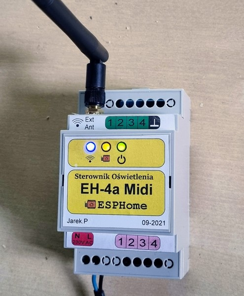
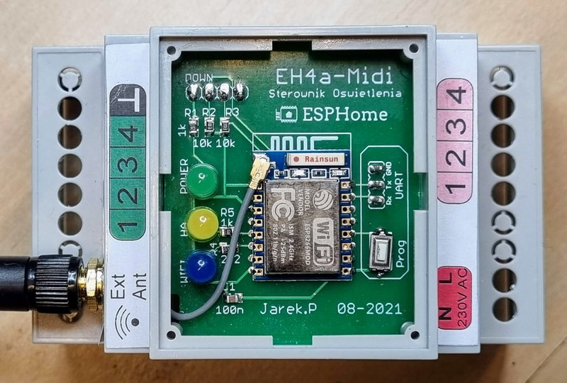
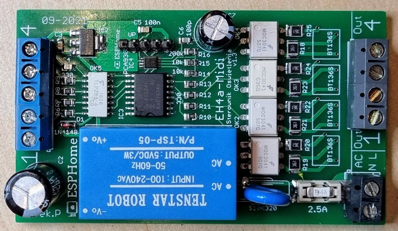
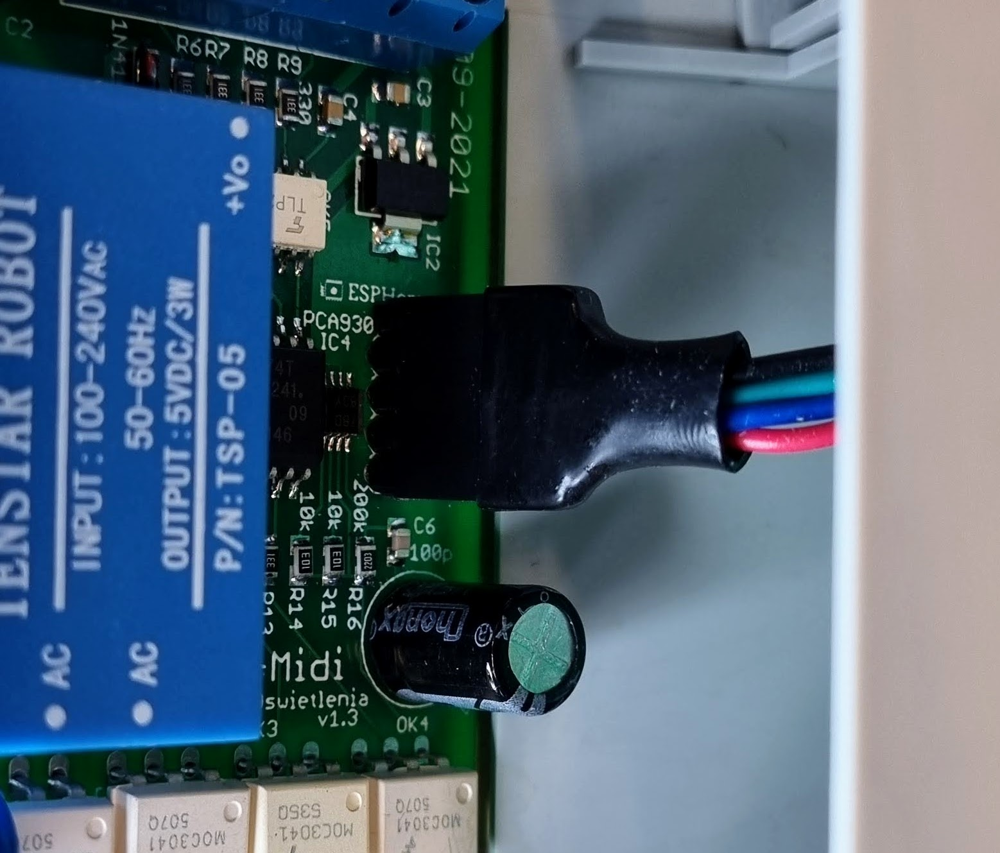

# ESPHome-4-4-Light-Driver
**Small light driver with 4 AC SSR outputs and 4 optoisolated inputs, designed for Home Assistant.**

## Design
Not so much to describe - just ESP with power supply and I2C expander, where four ports are used as inputs and four as outputs. Design of inputs and outputs was using by me from a years with other Home Automation systems (old stuff based on AVR CPUs, currently swapping by a bit more modern, HomeAssistant compatible devices), without any problems.  
Outputs are made as SSR relays, switched with zero-cross detection. It means safe switching of any active  load like lamps, etc, but reactive load is not allowed here, so please don't use this device with any induction load, like e.g. engines.   
Inputs are designed for use momentary buttons, each input port responds to shorting it with the COM output. Needed wiring of inputs (and outputs) is shown on schematic diagram, with grey lines.  

**WARNING! Don't connect input lines with AC installation or any external power lines, it must be fully separated, only direct connections to switch buttons are allowed**   

## Parts and components
Base of this device is an ESP-07 module, choosen due to possibility to connect external antenna. If it is not needed, can be used also ESP12 or any other with the same footprint, such change has be included in the code.
All other components are listed in BoM file.   

Connection between boards can be done by any method, pins have to be connected 1:1.   
Because reverse connection will damage ESP module, I would recommend to use any connection method, which avoid of it. Connector like  Molex KK mwould be the best solution, any other with raster 2,54 will be also ok. On my prototype I used ordinary goldpin connector with one pin more than needed, this pin is removed and corresponding pin in the plug is blinded by glue.

PSU: popular chinese HLK-PM01, 5V/0.6A. AC input is protected by varistor and 4A fuse. Due to lack of space I used small fuse SMD 1808 which is not recommended to use with voltage higher than 127V - I know, but I ignored it, because this part really suited me and here important for me was to have something able to make a break in the circuit. Load will be (should be!) active, so there shouldn't be a problems with overvoltage etc. Fuse is changeable, fuses and sockets were bought by me on Aliexpress:

https://www.aliexpress.com/item/32840204422.html

Terminal ports - I used old spare, which I had in my draver, but any with raster 5.08mm can be used here. Or - if needed, popular "green" sepparable Phoenix terminal blocks should fit here also.

## Assembly

PCB Gerber files are attached. It is not exactly the same version as shown on photos, it was a prototype, after I did some cosmetic corrections and here I put a final version.  
Both PCBs are prepared for standard DIN rail box case Gainta D3MG http://www.gainta.com/en/d3mg.html, nothing more is needed for assembly, both PCBs fit into the latches inside the case.    
External antena is optional, you can use it or stay with internal - up to you. When device is mounted inside of metal switchbox, external antenna mounted outside of box is strongly recommended.  
Stickers should be printed on self-adhesive paper.  

## Software

From ESP-Home perspective it is really simple device, shouldn't be any problems with the code. The only important thing which should be pointed out is that when you use ESP-07, its integration in ESPHome contains a bug, which is not corrected from the years (was reported many times as I know, without any result). So in declaration of board type, instead of esp_07, has to be used esp01_1m and with this workaround everything works fine.  
Basic proposal of code is added into the files, each input controls its corresponding output, where "short" click on the button just switch on or off the output, "long" click (press and hold more than 1s) switches off all outputs (really useful option for fast switching off the lights in the room). Clicks shorter than 50ms are ignored (debouncing), longer than 5s are also ignored (could be additionally reported as a short circuit on the line, it is not included in this code, but can be simply done).   
Only line 4 works a bit different, here is implemented a timer: short click switches on Out4  for 30 seconds (time value is set as at the top of code), after this time output  will be switched off. Each time it can be switched off manually by click the button again. And long click here works differently: it switches on the output permanently (until switching off by pressing button). 

## License

Shield: [![CC BY-NC-SA 4.0][cc-by-nc-sa-shield]][cc-by-nc-sa]

This work is licensed under a
[Creative Commons Attribution-NonCommercial-ShareAlike 4.0 International License][cc-by-nc-sa].

[![CC BY-NC-SA 4.0][cc-by-nc-sa-image]][cc-by-nc-sa]

[cc-by-nc-sa]: http://creativecommons.org/licenses/by-nc-sa/4.0/
[cc-by-nc-sa-image]: https://licensebuttons.net/l/by-nc-sa/4.0/88x31.png
[cc-by-nc-sa-shield]: https://img.shields.io/badge/License-CC%20BY--NC--SA%204.0-lightgrey.svg
